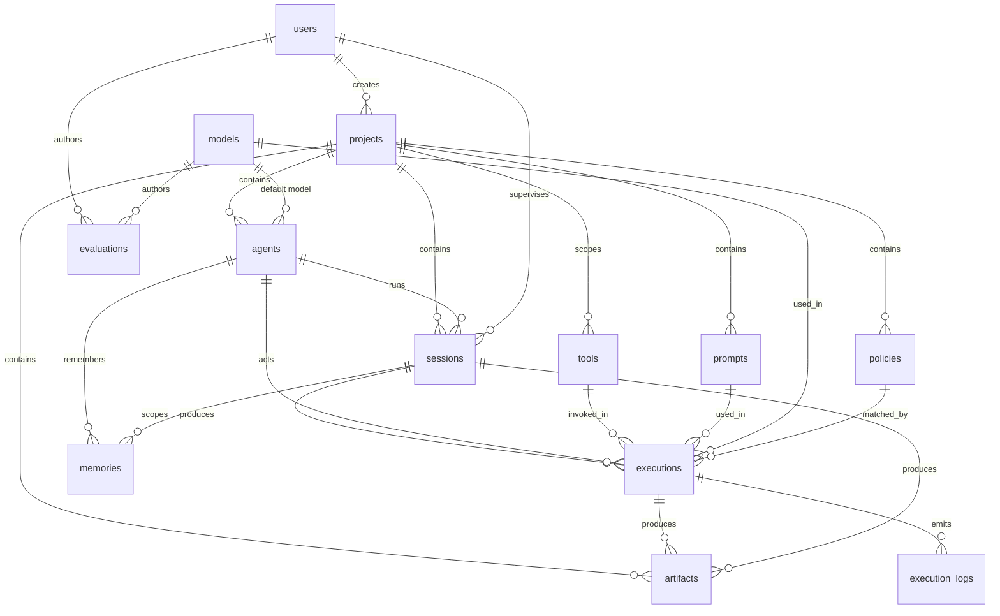

# RIF Runtime — Data Model Specification (Supabase)

Status: Draft v0.1 (2026-07-09).

This is the canonical schema specification for RIF Runtime's persistent
state, written to be evolved into SQL migrations for Supabase (Postgres 15+)
rather than designed ad hoc. It is mirrored to the "Database Schema
Specification — RIF Runtime (Supabase)" page on the RIF Runtime Notion hub;
this file is the version-controlled source of truth (see ADR-0007).

## Conventions

- Primary keys: `id uuid primary key default gen_random_uuid()`.
- Timestamps: `created_at timestamptz not null default now()`;
  `updated_at timestamptz` maintained by trigger where rows are mutable.
- Enumerations are Postgres `enum` types (`decision`, `posture`,
  `environment`, ...) matching the runtime's `str, Enum` Pydantic types so
  values serialize identically in both systems.
- Append-only tables (`executions`, `execution_logs`) are never updated or
  deleted — they are the durable form of today's `decisions.jsonl` /
  `posture_history.jsonl`.
- Row Level Security is enabled on every table; agents connect through the
  read-only tier (ADR-0004) and writes happen via the runtime's service role.

## Entities

### projects

Top-level container; one row per governed project/environment pairing
(ADR-0005).

| Column | Type | Notes |
|---|---|---|
| id | uuid PK | |
| name | text | unique with environment |
| slug | text unique | URL-safe identifier |
| environment | enum: dev, staging, production | |
| description | text | |
| created_by | uuid FK -> users | |
| status | enum: active, archived | |

### users

Human principals. In Supabase this shadows `auth.users` (FK on id).

| Column | Type | Notes |
|---|---|---|
| id | uuid PK, FK -> auth.users | |
| email | text unique | |
| display_name | text | |
| role | enum: owner, maintainer, reviewer, viewer | governance role, not Postgres role |

### agents

Non-human actors (orchestrator, auditor, deputy, custom).

| Column | Type | Notes |
|---|---|---|
| id | uuid PK | |
| project_id | uuid FK -> projects | |
| name | text | unique per project |
| kind | enum: orchestrator, auditor, deputy, custom | |
| model_id | uuid FK -> models, nullable | default model |
| trust_tier | smallint | T0–T3 |
| config | jsonb | agent parameters |
| status | enum: active, suspended, retired | |

### models

Registry of inference models/providers (local-first; cloud providers are
adapters).

| Column | Type | Notes |
|---|---|---|
| id | uuid PK | |
| provider | text | e.g. llama.cpp, anthropic |
| name | text | human label |
| model_ref | text | provider-specific identifier |
| context_window | integer | |
| capabilities | jsonb | tool-use, vision, ... |
| is_active | boolean | |

### sessions

One governed working session of an agent (optionally on behalf of a user).

| Column | Type | Notes |
|---|---|---|
| id | uuid PK | |
| project_id | uuid FK -> projects | |
| agent_id | uuid FK -> agents | |
| user_id | uuid FK -> users, nullable | supervising human |
| posture | enum: normal, elevated, restricted, locked | current posture |
| started_at | timestamptz | |
| ended_at | timestamptz, nullable | |
| status | enum: running, completed, aborted | |
| metadata | jsonb | |

### prompts

Versioned prompt templates.

| Column | Type | Notes |
|---|---|---|
| id | uuid PK | |
| project_id | uuid FK -> projects | |
| name | text | |
| version | integer | unique (project_id, name, version) |
| content | text | template body |
| variables | jsonb | declared placeholders |
| created_by | uuid FK -> users | |

### tools

Registry of invokable capabilities (MCP servers/tools, HTTP endpoints,
packages).

| Column | Type | Notes |
|---|---|---|
| id | uuid PK | |
| project_id | uuid FK -> projects, nullable | null = global |
| name | text | |
| kind | enum: mcp, http, package, shell | |
| spec | jsonb | tool schema / endpoint definition |
| allowed_scopes | text[] | e.g. read, write, admin (ADR-0004) |
| risk_level | enum: low, medium, high, critical | |
| enabled | boolean | |

### policies

Declarative policy rules — the durable form of `data/policies.json`
(`PolicyRule`).

| Column | Type | Notes |
|---|---|---|
| id | uuid PK | |
| project_id | uuid FK -> projects | |
| rule_id | text | stable human-readable id, unique per project |
| actor | text | `*` allowed |
| action | text | `*` allowed (wildcard precedence: see CLAUDE.md gotchas) |
| target | text | `*` allowed |
| effect | enum: allow, deny | |
| priority | integer | for future partial-wildcard precedence |
| enabled | boolean | |
| metadata | jsonb | rationale, links to ADRs |

### executions

Append-only record of every governed action — the Postgres form of
`decisions.jsonl`.

| Column | Type | Notes |
|---|---|---|
| id | uuid PK | |
| project_id | uuid FK -> projects | denormalized for direct RLS filtering |
| session_id | uuid FK -> sessions | |
| agent_id | uuid FK -> agents | denormalized for query speed |
| tool_id | uuid FK -> tools, nullable | |
| prompt_id | uuid FK -> prompts, nullable | |
| model_id | uuid FK -> models, nullable | |
| policy_id | uuid FK -> policies, nullable | matched rule, if any |
| action | text | e.g. network.request, mcp.invoke |
| target | text | host, tool name, package |
| decision | enum: allow, deny | |
| posture_at_decision | enum: normal, elevated, restricted, locked | |
| reason | text | engine's explanation |
| input | jsonb | hashed or redacted per logging rules |
| output | jsonb, nullable | hashed or redacted per logging rules |
| requested_at | timestamptz | |
| completed_at | timestamptz, nullable | |
| status | enum: pending, succeeded, failed, denied | |

### execution_logs

Append-only operational log lines attached to an execution (kept separate
from audit data by design).

| Column | Type | Notes |
|---|---|---|
| id | bigint identity PK | high volume; no uuid needed |
| project_id | uuid FK -> projects | denormalized for direct RLS filtering |
| execution_id | uuid FK -> executions | |
| ts | timestamptz | |
| level | enum: debug, info, warning, error | |
| message | text | sanitized; never secrets |
| data | jsonb | |

### artifacts

Files/outputs produced by executions or sessions (stored in Supabase
Storage; the DB row is metadata + hash).

| Column | Type | Notes |
|---|---|---|
| id | uuid PK | |
| project_id | uuid FK -> projects | |
| session_id | uuid FK -> sessions, nullable | |
| execution_id | uuid FK -> executions, nullable | |
| name | text | |
| kind | enum: file, report, evidence_bundle, diagram, other | |
| storage_path | text | bucket path |
| content_hash | text | sha256 — evidence pinning |
| size_bytes | bigint | |
| created_by | uuid FK -> users, nullable | null = agent-produced |

### memories

Durable agent memory with scoping and expiry.

| Column | Type | Notes |
|---|---|---|
| id | uuid PK | |
| project_id | uuid FK -> projects | enables project-scoped memories + direct RLS |
| agent_id | uuid FK -> agents, nullable | null for project-scoped memories |
| session_id | uuid FK -> sessions, nullable | |
| scope | enum: session, agent, project | |
| key | text | |
| content | text | |
| embedding | vector(1536), nullable | pgvector; semantic recall |
| importance | real | ranking hint |
| expires_at | timestamptz, nullable | |

### evaluations

Assessments of executions, sessions, agents, or prompts by humans or
evaluator models.

| Column | Type | Notes |
|---|---|---|
| id | uuid PK | |
| project_id | uuid FK -> projects | denormalized for direct RLS filtering |
| subject_type | enum: execution, session, agent, prompt | |
| subject_id | uuid | polymorphic; validated in app layer |
| evaluator_kind | enum: human, model | |
| evaluator_user_id | uuid FK -> users, nullable | |
| evaluator_model_id | uuid FK -> models, nullable | |
| score | numeric, nullable | |
| verdict | enum: pass, fail, needs_review | |
| criteria | jsonb | rubric + per-criterion results |
| notes | text | |

## Relationships

Key relationship rules:

- **projects** is the tenancy boundary: `project_id` is denormalized onto
  all tenant-specific tables (including high-volume ones like `executions`,
  `execution_logs`, `memories`, and `evaluations`) so every RLS policy
  filters directly on `project_id` without joins or subqueries.
- **executions** is the hub: it links session, agent, tool, prompt, model,
  and matched policy for every governed action; `execution_logs` and
  `artifacts` hang off it.
- **evaluations.subject_id** is polymorphic (with `subject_type`); enforced
  in the application layer, with a check constraint limiting `subject_type`
  values.
- Append-only tables get `revoke update, delete` from all non-service roles.

## Migration plan (toward Supabase)

1. `0001_enums.sql` — create enum types (`environment`, `posture`,
   `decision`, `agent_kind`, `tool_kind`, `risk_level`, ...)
2. `0002_core.sql` — `users`, `projects`, `models`
3. `0003_actors.sql` — `agents`, `tools`, `prompts`, `policies`
4. `0004_runtime.sql` — `sessions`, `executions`, `execution_logs`
   (+ indexes: `executions(session_id, requested_at)`,
   `executions(decision)`, `execution_logs(execution_id, ts)`)
5. `0005_knowledge.sql` — `artifacts`, `memories` (enable `pgvector`),
   `evaluations`
6. `0006_rls.sql` — enable RLS everywhere; read-only policies for the agent
   tier; service-role writes only

Backfill path from the current file-backed state: `data/policies.json` ->
`policies`; `decisions.jsonl` -> `executions` (one row per decision,
`status = denied` or `succeeded`); `posture_history.jsonl` -> posture
transitions can be derived, or kept as an optional `posture_events` table if
needed later.

Per ADR-0007, these migrations are authored in this repository, applied to
**dev** first, and promoted to staging/production only through CI.
