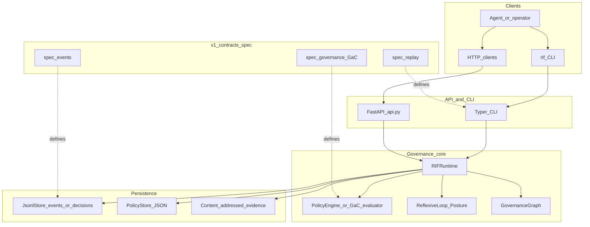
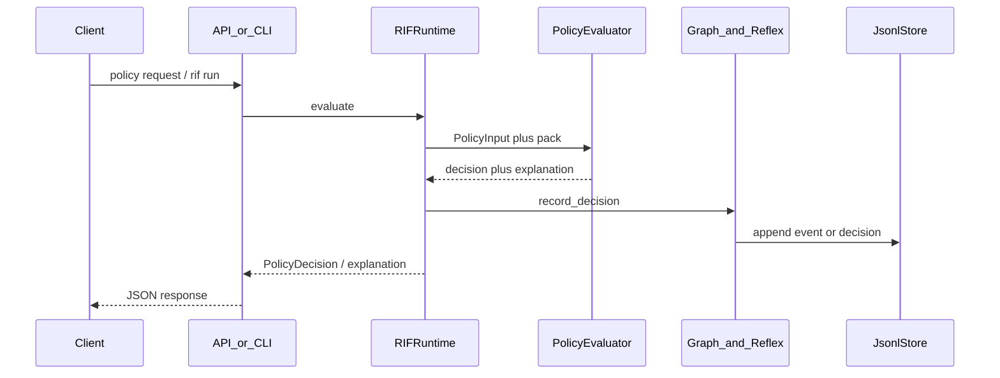

# RIF Runtime architecture (v1.0 view)

Short circuit (always true of the MVP core):

```text
Agent request
  → Policy evaluation
  → Decision
  → Reflexive posture + governance graph
  → Append-only persistence
  → Audit / replay / CLI
```

Trust model: environment-scoped hosts, posture escalation, fail-closed control
plane auth for mutating routes. Deny-by-default is the **GaC** target; today’s
engine still has legacy default-allow after constraints — see CHANGELOG.

## Component diagram



## Evaluate path (sequence)



## v1.0 target vs MVP

| Area | MVP (`0.3.x`) | v1.0 target |
| --- | --- | --- |
| Audit unit | `PolicyDecision` JSONL | `rif.runtime.event/v1` envelopes |
| Replay | Summary recover from decisions | Pure / verify / time-travel engine |
| Policy | Exact rules + hardcoded constraints | GaC policy packs |
| CLI | serve / check / replay file / status | run / replay / verify / inspect / policy / evidence |

Details: [ARCHITECTURE.md](ARCHITECTURE.md) (one-pager), root aspirational essays may lag — prefer this file + `spec/`.
